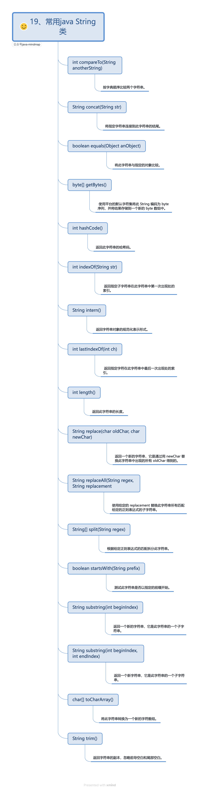

## String类

```java
public class Demo {
  public static void main(String[] args) {
    /* 字符串类型变量的声明与赋值 */
    String s1 = "Hello, World!";
    int v1 = 100000000;
    /* String类型变量可以和八种基本类型变量“连接”，返回字符串！ */
    System.out.println(s1 + v1);
    /* String类方法调用示例 */
    System.out.println(s1.length());
    System.out.println(s1.hashCode());
    System.out.println(s1.indexOf("llo"));
  }
}
```