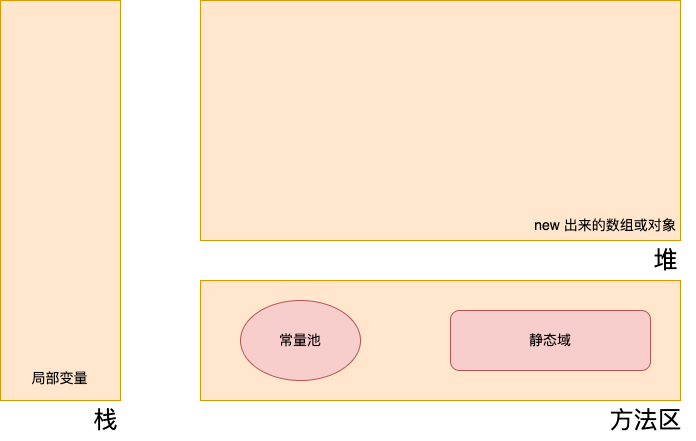

## 变量
- 变量声明：数据类型 变量名 = 变量值
```java
public class Demo {
  public static void main(String[] args) {
    int myAge = 17;
    System.out.println(myAge);
  }
}
```

## 变量类型
- #### 基本数据类型
  - 整数类型
    - byte: (-2^7,2^7-1), default 0
    - short: (-2^15,2^15-1), default 0
    - int: (-2^31,2^31-1), default 0
    - long: (-2^63,2^63-1), default 0L
  - 浮点类型
    - float: 32bit, default 0.0F
    - double: 64bit, default 0.0D
  - 字符类型
    - char: 16bit unicode, 可以存储任意字符。
  - 布尔类型
    - boolean: true/false, default false
- #### 引用数据类型
  - 数组{}
  - 类class：字符串属于类
  - 接口interface
> 从内存的角度理解基本数据类型和引用数据类型：引用类型变量储存的是地址(可以为空)，基本类型变量储存的是实际值。


#### 基本数据类型代码示例：
```java
public class Demo {
  public static void main(String[] args) {
    byte v1 = 127;
    short v2 = 128;
    int v3 = 129;
    long v4 = 130L;
    float v5 = 135.99F;
    double v6 = 140.99D;
    char v7 = 'w';
    boolean v8 = true;
  }
}
```

## 自动类型提升
> 整型、实型、字符型数据可以混合运算。运算中，不同类型的数据先转化为同一类型(容量最大的类型），然后进行运算。
> byte,short,char—> int —> long—> float —> double 

## 强制类型转换
> 在把容量大的类型转换为容量小的类型时必须使用强制类型转换。
> (type) value