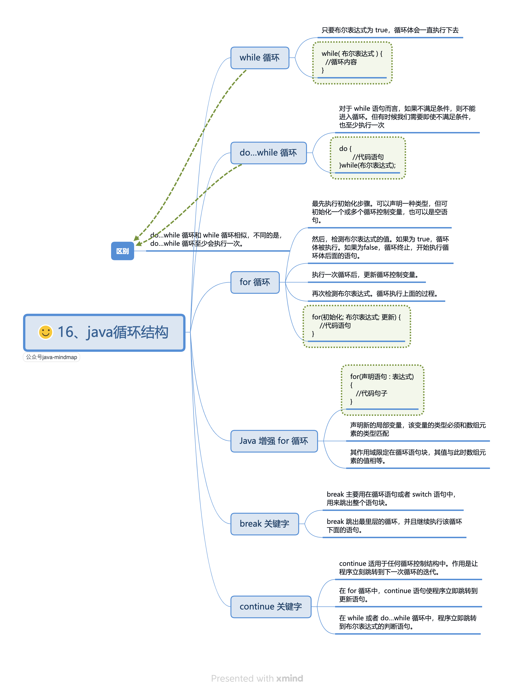

```java
public class Demo {
  public static void main(String[] args) {
    String[] fruits = { "Apple", "Banana", "Orange" };
    /* 增强的for循环（javascript语法） */
    for (String fruit : fruits) {
      System.out.println(fruit);
    }
  }
}
```