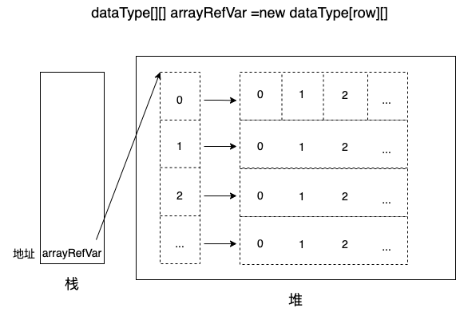

## 一维数组
- 声明数组变量：`dataType[] arrayRefVar;`
- 声明并初始化数组：
  - `dataType[] arrayRefVar = new dataType[arraySize];` 
  - `dataType[] arrayRefVar = {v0,v1,...}; `
- 调用数组元素：`arrayRefVar[index]，0<=index<=arrayRefVar.length-1`
- 数组元素默认初始化值：
  - 整型：0
  - 浮点型：0.0
  - char：0或'\u0000'
  - boolean：false
  - 引用类型：null
```java
import java.util.Scanner;

public class Demo {
  public static void main(String[] args) {
    int[] intArray = new int[5];
    String[] strArray = { "Wujie", " ", "forever" };
    for (int item : intArray) {
      System.out.print(item + "\t");
    }
    for (String item : strArray) {
      System.out.print(item + "\t");
    }
  }
}
```
## 二维数组
> 数组元素是一维数组的一维数组
- 声明数组变量：`dataType[][] arrayRefVar;`
- 声明并初始化数组：
  - `dataType[][] arrayRefVar = new dataType[row][col];`
  - `dataType[][] arrayRefVar = new dataType[row][];`
  - `dataType[][] arrayRefVar = {{...},...};`
- 调用数组元素：arrayRefVar[row][col];

```java
import java.util.Scanner;

public class Demo {
  public static void main(String[] args) {
    int[][] intArray = new int[3][3];
    String[][] strArray = { { "Hello ", "wujie" }, { "Hello ", "yumw" } };
    for (int i = 0; i < intArray.length; i++) {
      for (int j = 0; j < intArray[i].length; j++) {
        System.out.println("(" + i + "," + j + ")" + ":" + intArray[i][j]);
      }
    }
    for (int i = 0; i < strArray.length; i++) {
      System.out.println(strArray[i][0] + strArray[i][1]);
    }
  }
}
```

## Arrays工具类
[官方文档](https://docs.oracle.com/javase/8/docs/api/)
1. static boolean equals(type[] a1,type[] a2)
2. static String tostring(type[] a)
3. static void fill(type[] a[,int fromIndex,toIndex],type val)
4. static void sort(type[][,int fromIndex,int toIndex])
5. static int binarySearch(type[] a[,int fromIndex,int toIndex],type key)
```java
import java.util.Arrays;

public class Demo {
  public static void main(String[] args) {
    int[] a1 = { 1, 2, 3 };
    int[] a2 = { 2, 1, 3 };
    int[] a3 = new int[3];
    Arrays.fill(a3, 1);
    Arrays.sort(a2);
    System.out.println(Arrays.equals(a1, a2));
    System.out.println(Arrays.toString(a3));
    System.out.println(Arrays.binarySearch(a1, 1));
  }
}
```

## 数组常见异常
1. 数组角标越界：ArrayIndexOutOfBoundsException
2. 空指针异常：NullPointerException